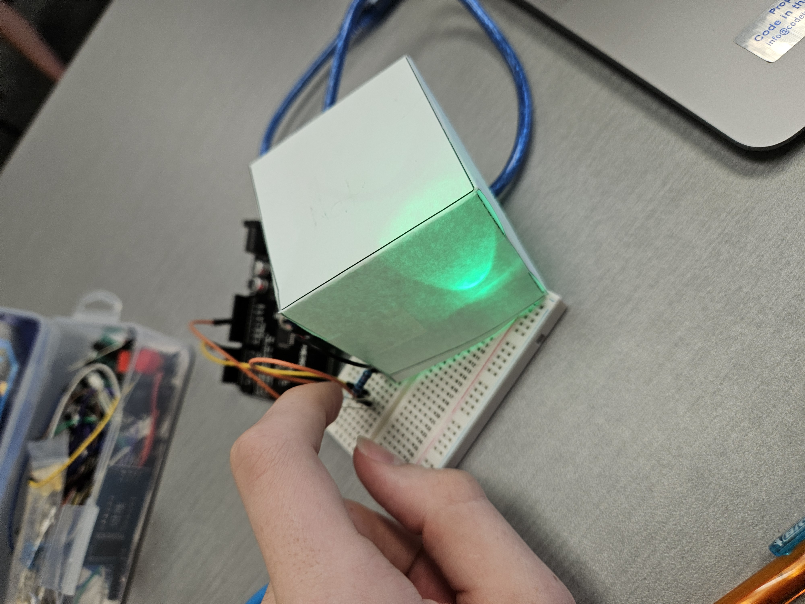
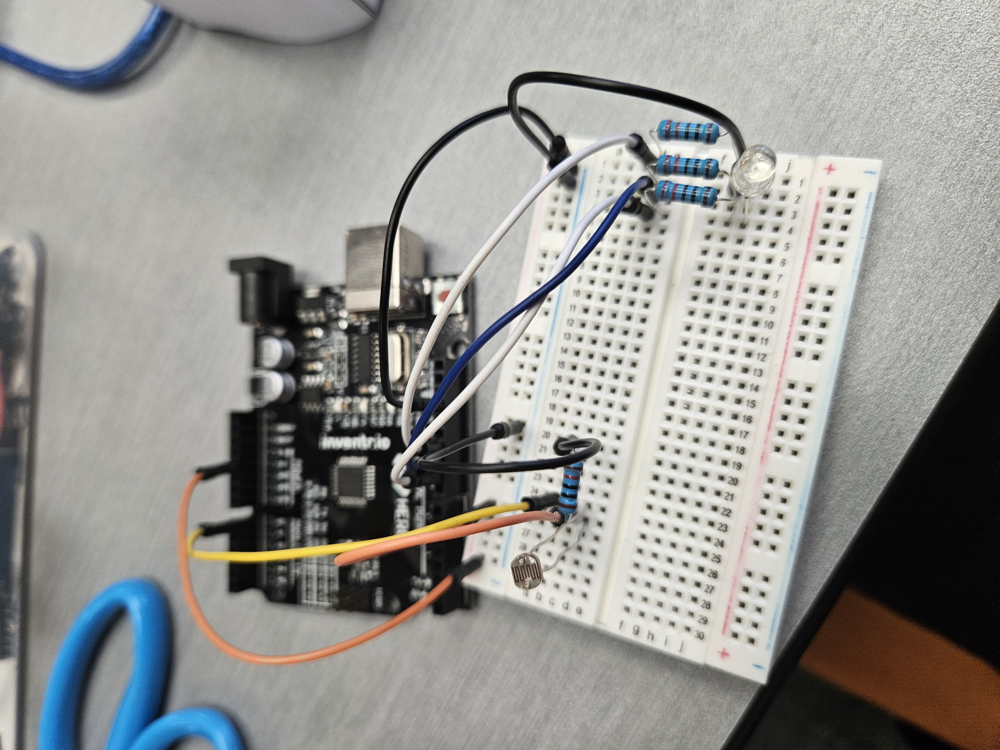

# Flashing LED Light

This Arduino project uses a **Light Dependent Resistor (LDR)** to measure light levels. When the light level drops below a set number (700 for this project), an **RGB LED** begins flashing through a sequence of colors. A **paper cube cutout** can be used, optionally, to enhance the visual effect of the LED.

---

## Components Used

| Component             | Quantity |
|----------------------|----------|
| Arduino Uno R3       | 1        |
| RGB LED (common cathode) | 1    |
| 220Ω Resistors        | 3        |
| 10kΩ Resistor         | 1        |
| LDR (Photoresistor)   | 1        |
| Breadboard           | 1        |
| Jumper Wires         | 9      |
| Paper Cube Cutout | 1 |

---

## Installation & Setup

1. **Connect Power to the Bread Board**
   - 5V → Bread Board positive strip (+)
   - GND → Bread Board negative strip (-)

1. **Connect the LDR**  
   - One leg of LDR → 5V  
   - Other leg of LDR → A0 and one end of the 10kΩ resistor  
   - Other end of the resistor → GND  

2. **Connect the RGB LED** *(the order of pins for the RGB LED used: Red, Cathode, Blue, Green)* 
   - Red Pin → 220Ω Resistor → Digital Pin 11  
   - Green Pin → 220Ω Resistor → Digital Pin 9  
   - Blue Pin → 220Ω Resistor → Digital Pin 10  
   - Common Cathode Pin → GND

3. **Upload the Code**:
   - Open [Arduino IDE](https://www.arduino.cc/en/software/).
   - *Install the program if you don't already have it.*
   - Connect your Arduino Uno via USB.
   - Upload your `.ino` sketch.

4. **Add the Paper Cube (Optional)**  
   Place the paper cube cutout over the RGB LED to diffuse the flashing colors. *May need to cut the cube in some places for the wires to fit*.

---

## How It Works

- The **LDR** continuously measures the surrounding light level.
- If the analog reading from the LDR is **below 700**:
  - The **RGB LED starts flashing** through set colors in the code (like red, green, blue, purple, ect.).
- When it reads above **700**:
  - The LED turns **off**.

---

## Images / Videos

- 
- 

---

## Simulation

> Use an online simulator like [Tinkercad](https://www.tinkercad.com/) to view the project simulation.

- [Tinkercad Simulation Link](https://www.tinkercad.com/things/5i3UnPZWMWp-mood-light-nat?sharecode=4IkUhLk60JT4a3moR9Q4A7Ld3d45VGpm4YomhAr9dv4)

---

## Credits

- Project by: *Nat King*
- Inspired by: My manager/instructor's mood light project.
  My Manager's Github Link: [dmccoy1](https://github.com/dmccoy1)
---
